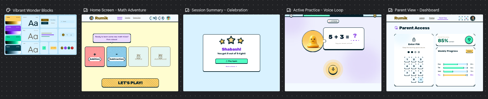
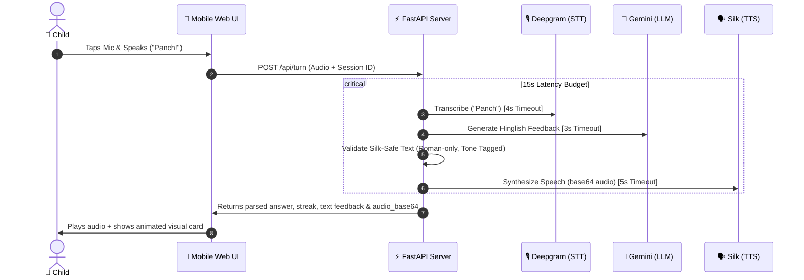

# 🎙️ Rumik — Arithmetic Voice Tutor

> **A mobile-first, zero-latency-feel AI tutor tailored for primary-school children in India.**



---

## 🇮🇳 The Story: Solving India’s Foundational Numeracy Crisis

India is home to **260+ million school-going children**—the largest student population on the planet. They are the future of the nation, yet their foundational learning journey faces structural bottlenecks that have proven notoriously difficult to solve at scale.

### 📉 The Foundation is Slipping
*   **Declining Enrollments & Faith:** Over the past decade, government school enrollments have faced steady declines. Parents are quietly losing faith in the basic system because millions of children leave the primary years without mastering foundational literacy or numeracy (FLN).
*   **Overcrowded Classrooms:** The physical teacher-to-student ratio is a bottleneck. A single teacher is routinely tasked with managing and teaching **40 to 60+ students**. In this environment, the personalized, patient, interactive math coaching a 7-year-old desperately needs is physically impossible.

### ⏰ The Parental Reality: Stretched and Strained
Whether in urban high-rises or rural villages, parents simply **do not have the time**. 
*   In **urban areas**, parents juggle grueling gig-economy shifts, long manual hours, and multi-hour commutes.
*   In **rural areas**, parents labor from sunrise to sunset in fields or at construction sites. When they get home, exhaustion takes over.

### 📚 Overcoming the Education Gap (The Supervision Loop)
Even if parents manage to carve out 30 minutes, **academic confidence is a barrier**. Many parents did not have the privilege of completing their own primary education. Teaching early arithmetic feels intimidating, leading to stress rather than learning.

**Rumik flips the script.** 
It allows *any* parent—regardless of their own level of literacy—to actively supervise and support their child's education. A parent only needs to sit beside their child, hand them a budget smartphone, and let the child speak naturally in friendly, welcoming Hinglish. Rumik behaves as an infinite, patient, warm private tutor that never gets frustrated, correcting gently and praising loudly.

---

## 🚀 The Product Experience

Rumik enables children to tap-to-speak answers to simple math equations, receives instant, warm Hinglish voice feedback, and naturally advances to the next question. Engineered specifically for a **60-second live judge demo**, it is designed to feel alive, warm, and rock-solid under real-world connectivity constraints.

---

## 🌟 The Cool Moment (The 60-Second Pitch)

Most AI tutors fail in live demos due to slow API roundtrips, brittle pronunciation scoring, or open-ended chat derailments. Rumik solves this by pairing a **deterministic arithmetic lesson engine** with a **state-of-the-art voice pipeline**.



---

## ⚙️ Architecture & Tech Stack

Rumik is built from the ground up to support **fast performance on budget Android devices** with high latency or low bandwidth.

*   **Backend:** FastAPI (Python 3.14) — Server-rendered Jinja2 templates keeping the payload tiny.
*   **Speech-to-Text (STT):** Deepgram Nova-2 (`hi` language model) — Optimized for low latency.
*   **LLM Tutor Brain:** Gemini 2.5 Flash — Contextually generates Hinglish feedback based on attempts, correctness, and streak.
*   **Text-to-Speech (TTS):** Silk Mulberry 1.5 — Delivers human-like voice synthesis with native Hinglish pronunciations and specific emotional tone tags.
*   **Design System:** *Vibrant Wonder Blocks* — Vanilla CSS with custom design tokens. No bloated CSS frameworks or external JavaScript libraries.

---

## 🛡️ Robustness & The "Never-Freeze" Failure Matrix

During a live hackathon demonstration, network glitches are inevitable. Rumik implements **strict latency budgets** (Total Turn Budget = 15s) and multiple programmatic fallbacks to ensure the app never crashes or freezes.

| Potential Demo Failure | Programmatic Fallback Behavior | User-Visible Experience |
| :--- | :--- | :--- |
| **Microphone Denied** | Instantly collapses mic button and auto-focuses standard input. | *“Mic allowed nahi hai, please answer type karo.”* |
| **Deepgram Timeout** | Aborts transcription, falls back to the typed-answer route. | Shows the parsed textbox, letting the user check or try voice again. |
| **Unclear Audio / No Number** | Keeps the current question active; triggers special "no number" feedback. | *“Mujhe number nahi mila, ek baar phir boliye.”* |
| **Gemini LLM Failure** | Pulls instant hardcoded Hinglish responses from `tutor_fallback.py`. | Seamless progression; zero raw API errors shown to the child. |
| **Silk TTS Failure** | Proceeds without base64 audio; displays text-only feedback. | Exposes a *"Play tutor voice"* retry button; the lesson goes on. |
| **Autoplay Blocked** | Catches browser autoplay restrictions silently. | Shows a clean, clickable button: *“Tutor ki voice suno”*. |

---

## 🎨 Premium Mobile Design System

Rumik adheres to strict, production-grade frontend practices rather than hacking together page-specific designs:

1.  **Single Source of Truth CSS:** All design tokens (radii, custom shadows, colors like *Coral*, *Sky*, and *Success Mint*) live in [`tokens.css`](file:///home/neo/.gstack/projects/unknown/rumik/app/static/css/tokens.css).
2.  **Zero CDNs:** Avoids the Tailwind CDN or Google Fonts layout-shifts. All styles are cached immediately.
3.  **Subsetting Icons:** Material Symbols are programmatically subsetted using `icon_names=` in [`base.html`](file:///home/neo/.gstack/projects/unknown/rumik/app/templates/base.html) so only the 13 icons used in the mockups are downloaded (saving ~120KB of font payload!).
4.  **Micro-Animations:** Fluid CSS animations (`.anim-pop-in`, `.mic[data-state]`) keep the interface alive during transitions.

---

## 🚀 Running Locally

### 1. Prerequisite Keys
Make sure you have your API keys ready. Create a `.env` file from the template:
```bash
cp .env.example .env
```
Fill in the following keys:
- `DEEPGRAM_API_KEY` (from console.deepgram.com)
- `GEMINI_API_KEY` (from ai.google.dev)
- `SILK_API_KEY` (from silk.rumik.ai)

### 2. Launch the App
```bash
# Setup virtual environment
python -m venv .venv
source .venv/bin/activate

# Install highly optimized dependencies
pip install -r requirements.txt

# Start the dev server with live-reloads
uvicorn app.main:app --reload --port 8000
```
Open **`http://localhost:8000`** in your browser. 
*(Note: To test microphone transcription on a physical phone, serve the app over HTTPS using ngrok or a Cloudflare Tunnel.)*

### 3. Run the Test Suite
Confirm everything is passing:
```bash
PYTHONPATH=. .venv/bin/pytest
```

---

## 🛣️ Project Roadmap

- [x] **Phase 0-1:** Silk contract confirmed & Core Design System established.
- [x] **Phase 2-3:** In-memory session tracking, digit/Hinglish parser & Deepgram voice input.
- [x] **Phase 4-5:** Gemini LLM tutor integration, Silk-Safe validation regex, and audio playback.
- [ ] **Phase 6:** Build `/summary` and `/parent` reporting screens with visual progress graphs.
- [ ] **Phase 7:** Live rehearsals, HTTPS testing, and Lighthouse optimization scoring.

---

*Rumik is built for the Indian classroom of tomorrow — starting with a bulletproof, delightful demo today.*
